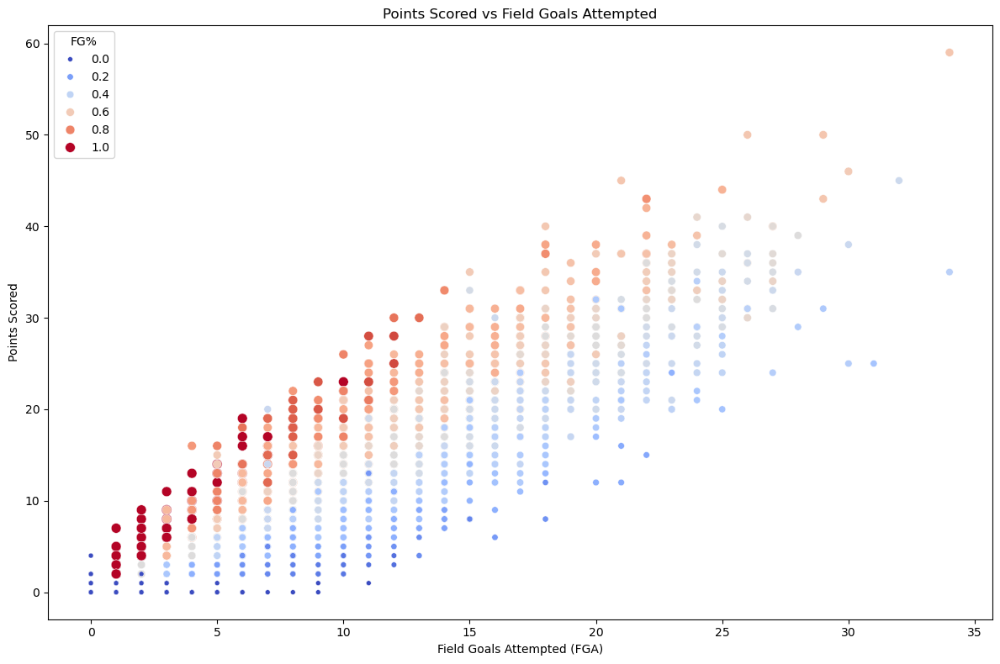
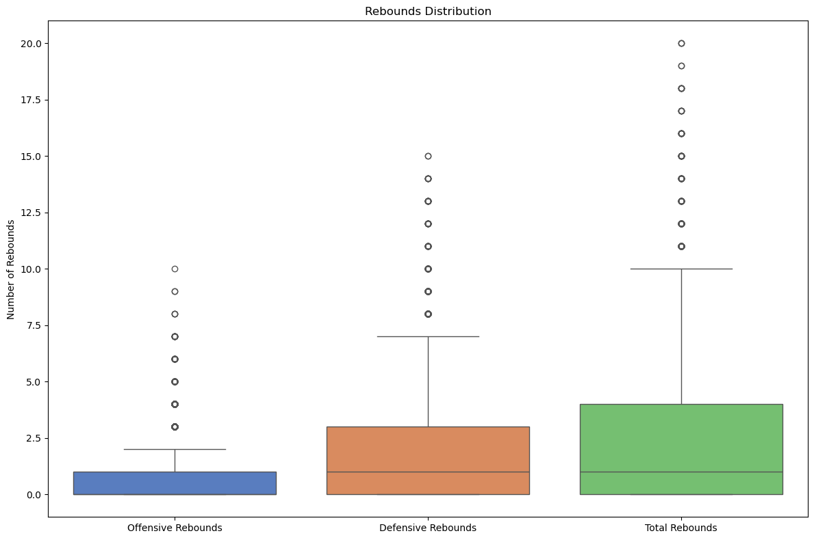
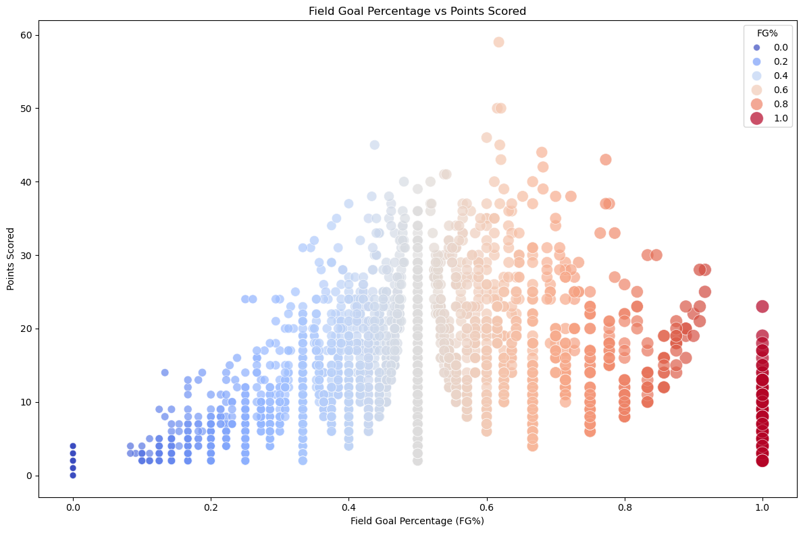
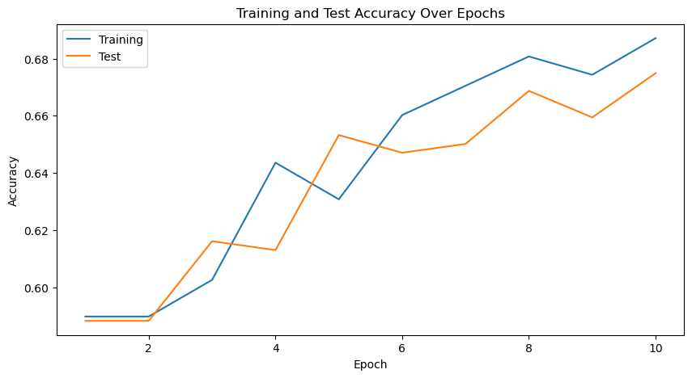
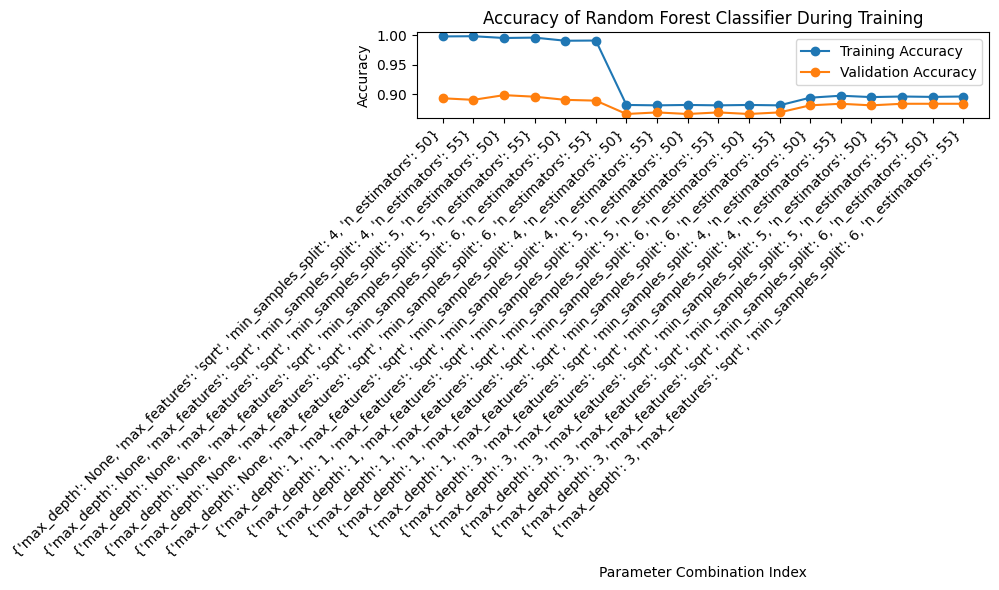
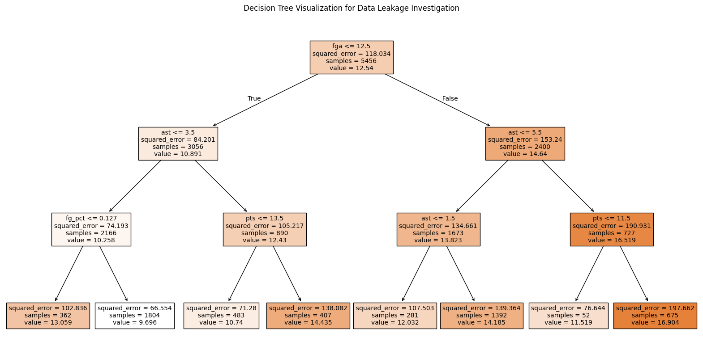

# PrizePicksPredictor

Minchan Kim, David Moon, Mihir Joshi, Rohil Kadekar, Jason Kim

---------

## Introduction

The realm of sports analytics has witnessed a significant transformation with the advent of advanced machine learning techniques. These methods, when applied to vast datasets, have the potential to uncover hidden patterns and insights that can revolutionize the way we perceive and predict athletic performance. In this project, we delved into the realm of daily fantasy sports, specifically focusing on PrizePicks, a platform that allows users to bet and make predictions on individual player performances. Our objective was to develop a robust machine learning model capable of accurately predicting whether a player will outperform or underperform their projected performance, thereby providing a valuable edge to fantasy sports enthusiasts.

To achieve this goal, we leveraged a comprehensive dataset sourced from PrizePicks, encompassing a wide range of player statistics and historical performance data. By employing a combination of feature engineering techniques and state-of-the-art machine learning algorithms, we aimed to construct a model that can effectively capture the intricate nuances of player performance and factors that influence their outcomes.

More specifically, in this project, we aimed to develop models to predict whether NBA players will score over or under the point, rebound, and assist lines set by PrizePicks. By leveraging a dataset of historical NBA player statistics from the official NBA website, we analyzed a range of variables such as points per game, shooting percentages, minutes played, and much more. Our focus in this project was to identify patterns and trends that influence the player in a specific match-up, allowing us to make a more accurate prediction than a human can. Our approach was optimized in predicting player outcomes by experimenting with various variables to increase its accuracy. This study provides a data-driven strategy for enhancing player prop betting predictions.

For the binary classification task at hand of predicting underperformance or overperformance of projections , we developed and tuned two different models: a Long Short-Term Memory (LSTM) recurrent neural network (RNN) and a random forest classifier. The LSTM model is well-suited for capturing temporal dependencies in time series data, such as player performance trends over time. The random forest classifier, on the other hand, is a powerful ensemble method that can handle complex decision-making processes.

The implications of this project extend beyond the realm of fantasy sports. A successful model could potentially aid sports bettors, coaches, and even front-office personnel in making informed decisions. Additionally, this project contributes to the broader field of sports analytics by demonstrating the power of machine learning in predicting individual player performance, a challenge that has long intrigued a variety of stakeholders alike.

---------

## Methods:

### Data Exploration:
In our initial exploration of the dataset, we began by examining key player-based performance metrics, including points scored, field goals attempted (FGA), field goal percentage (FG%), rebounds, and assists. To uncover potential trends and patterns, we created visualizations such as scatterplots and box plots to help us view the overall trend. For example, we plotted points scored against FGA to assess the relationship between these variables and incorporated FG% as a color scale to explore additional dimensions of player efficiency. We also generated box plots for offensive, defensive, and total rebounds to analyze their distributions, compare variability, and identify potential outliers. Beyond these analyses, we reviewed the dataset's structure to identify columns that might not be directly relevant to our predictive objectives. Metrics such as turnovers and personal fouls (PF) were dropped because we believed that those metrics were not as contributing to what we were trying to solve.

### Preprocessing Steps:

1. Drop Irrelevant Columns: There are some columns such as turnover, pf, and player_id that we would drop as they are not very important for predictions on a player's particular stats such as for how many points they make / rebounds they receive / assists they make. After combining the first and last name of players, we would drop the individual columns as well as the player_id.
2. We would prepare a time-series data for lagged versions of key stats (points, assists, rebounds) to capture the player’s performance trends over recent games. For example, features like on_hotstreak_pts, on_hotstreak_rebounds, or on_hotstreak_assists.
3. We would also create new features like points per minute played, assists per minute played, and rebounds per minute played.
4. We would normalize features like 'fgm', 'fga', 'oreb', 'dreb', 'ast', 'stl', 'blk' and 'pts' to a standard scale (mean = 0, std = 1).

#### Prizepicks Projections
Since PrizePicks lines change daily we selected a specific week to lock in the lines for our predictions:

1. We picked a single week and specific players to make a prediction within the NBA season to focus on our predictions. By fixing this time period, we ensured that our data and model align with the lines available during that week, providing a consistent basis for evaluating player performance.
3. Lock in Lines for Each Player: For this chosen week, we recorded PrizePicks lines for points, rebounds, and assists for each player. These lines will serve as the target thresholds in our model, determining whether a player will go “over” or “under” in each category.

### [Data Preprocessing and LSTM RNN (First Model)](https://github.com/D2jc/PrizePicksPredictor/blob/main/Data%20Processing%20and%20First%20Model.ipynb)

The notebook for the First Model can be found at ```Data Processing and First Model.ipynb```

1. We converted the 'Date' column to accurately ensure a proper day, month, and year date setting in the column.
2. We combined the 'first_name' and 'last_name' to create a new column of 'player_name' so that when we merge the Prizepicks data, it can match up to the individual player name.
3. We ended up dropping the 'first_name', 'last_name', 'turnover', and 'pf' as for the first two
4. We checked for any missing data and found that there was none missing.
5. We merged the projections dataframe from Prizepicks with the data we have preprocessed so we had a dataframe that had 'player_name ', 'date', 'fgm', 'fga', 'fg_pct', 'fg3m', 'fg3a', 'fg3_pct', 'ftm', 'fta', 'ft_pct', 'oreb', 'dreb', 'reb', 'ast', 'stl', 'blk', 'pts', and 'line_score'.
6. We then created features 'on_hotstreak_pts, 'on_hotstreak_asts', and 'on_hotstreak_reb' where we computed the last 5 averages in points, assists, and rebounds for each player. Then, gave a binary value of either '1' to indicate that they are doing better than the average of their past 5 games, and a '0' if they are not.
7. We also created a feature called 'above_threshold' which is a binary label where if the player exceeded the PrizePicks line, they got a '1', and if they did not, the player had a '0'.
8. Lastly, we scaled our features 'fgm', 'fga', 'pts','fg3m','fg3a','fta','ftm', as we believe that these features are directly tied to player performance and ensures that no single feature dominates the model simply due to its scale.
9. We implemented a function to create sequences of player data for time-series modeling, where each sequence represents a sliding window of consecutive games for a given player.
10. Then, we split the data into training and testing sets while ensuring that sequences from the same player are kept intact within either set. By grouping sequences based on player names, 80% of each player’s data is allocated for training, and the remaining 20% is reserved for testing. We also converted the data into Pytorch tensors.
11. Following the splitting of our data and conversion, we trained and tested our data on a baseline Long-short Term Model.

### [Random Forest Classifier (Second Model)](https://github.com/D2jc/PrizePicksPredictor/blob/main/Second_Model.ipynb)

The notebook for Milestone 4 (Second Model) can be found at ```Second_Model.ipynb```

1. We completed pre-processing of the data in the same way as in Milestone 3, dropping unnecessary columns, standardized some of the features, aggregated features to extract new features like hot streaks. We used PrizePicks targets as the y variable and the cleaned data features as our x variables.
2. We created an initial random forest classifier with 75% train and 25% test split.
3. We plotted train and test accuracy for different settings for hyperparameters using matplotlib, which shows the hyperparameters that we chose as the best possible ones.

---------

## Results

### Data Exploration

#### Points Scored vs. Field Goals Attempted ####



##### Description: #####
This scatterplot examines the relationship between the number of field goals attempted (FGA) and points scored. Data points are sized and colored based on FG%, providing additional insight into shooting efficiency. This figure explores scoring tendencies and efficiency across players, emphasizing how attempts correlate with outcomes and potentially other features.
##### Key Insights: #####
While more field goal attempts generally correspond to more points scored, the efficiency (FG%) varies, highlighting the importance of this metric in predictive models.

#### Rebounds Distribution ####



##### Description: #####
This boxplot shows the distribution of offensive rebounds, defensive rebounds, and total rebounds among players. The data showcases variability across these categories, providing an overview of rebounding patterns, which are critical for feature selection and understanding player contributions.
##### Key Insights: #####
Defensive rebounds are generally higher than offensive rebounds, but total rebounds show significant variability, reflecting differences in player roles and game dynamics.

#### Field Goal Percentage vs Points Scored ####



##### Description: #####
This scatterplot visualizes the relationship between field goal percentage (FG%) and the total points scored in a game. Each data point is color-coded and sized based on FG%, offering a multidimensional perspective of the relationship. Highlights trends in player efficiency and scoring performance, helping to identify patterns or anomalies that may influence predictive modeling.
##### Key Insights: #####
As expected, players with higher FG% generally score more points. However, when FG% becomes exceptionally high, the limited number of attempts can result in a high FG% but a lower overall point total. Additionally, outliers highlight variability in player contributions, suggesting that factors beyond shooting efficiency influence scoring performance.

### Data Preprocessing
Column Selection:
- Irrelevant columns such as `turnover`, `pf` are removed.
- The individual name components (`first_name`, `last_name`) were dropped after being merged into a single `player_name` column.
- By focusing on performance-related metrics, the dataset became more targeted for model training.
  
Additional Features:
- New features were engineered, such as "on_hotstreak" metrics (points, rebounds, assists) to capture player trends over recent games.
- Derived statistics like points per minute played and assists per minute played were introduced to better capture player efficiency.
  
Normalization:
- Performance metrics such as `fgm`, `fga`, `reb`, and `ast` were normalized to ensure all features contributed equally during training.


### LSTM RNN Model




### Random Forest Classifier






---------

## Discussion

### Preprocessing

The preprocessing stage was very important to make sure the dataset was clean, relevant, and optimized for our models. Initially, the raw data was not too littered with redundant columns, some columns such as `turnover`, `pf`, and separate `first_name` and `last_name` were deleted. These columns were irrelevant to our predictive objectives and could introduce noise into the models. By combining names into a single `player_name` column to help with joining the Prizepicks dataframe and dropping irrelevant fields, we were able to streamline the dataset for our models. The merging of PrizePicks data was also important in aligning player performance statistics with the PrizePicks lines. The PrizePicks dataset had our daily projections for points, rebounds, and assists, which served as the basis for our target variables (Though for our project, we only used points). After creating the `player_name` column, we joined the PrizePicks data with the NBA player performance data on this field and the date column. This ensured that the PrizePicks lines corresponded accurately to the same players and game dates in our dataset.

Normalization was also important in our preprocessing step. Features such as fgm (field goals made), fga (field goals attempted), and pts (points scored) were scaled to a standard distribution (mean = 0, std = 1) to prevent larger-scale features from dominating the model. Without this step, features with higher numerical ranges could disproportionately influence the training process, which can lead to worse predictions. Feature engineering was also utilized in our dataset as we felt like there could be more features that can help with the prediction. The "on_hotstreak" metrics, which captured a player's performance over the last five games, provided temporal insights into a player's form. In addition, features like points per minute and assists per minute gave deeper context into player efficiency, making the data more representative of actual performance trends.

While our preprocessing improved the dataset significantly, several limitations remain. For instance, we relied solely on static player performance metrics and PrizePicks lines, ignoring contextual factors such as team matchups, player injuries, or specific player match-ups. By using other data sources that can cover play-by-play statistics or player analytics with further insight, could significantly enhance the model's ability to make context-aware predictions. Overall, we believe that these preprocessing steps were effective in creating a dataset capable of capturing whether a player outperformed or underperformed relative to their average metrics, enabling more reliable predictions when using our models.

### LSTM RNN Model

The Long Short-Term Memory (LSTM) Recurrent Neural Network (RNN) was our first attempt to model the temporal dependencies in player performance data. With a training accuracy of 68.72% and a test accuracy of 67.49%, we thought that the model performed moderately well in comparison to a random guessing of 50%. However, there were notable limitations in its ability to generalize and accurately predict outcomes, as evidenced by the relatively low F1 score of 48.78%, precision of 69.44%, and a recall score of 37.59%.

We thought that LSTMs are well-suited for time-series data because they do well at capturing sequential dependencies and long-term trends. Their architecture allows them to selectively remember or forget information over time. This makes them particularly effective for analyzing temporal data, where the sequence and order of events matter. For our project, this was a natural fit, as player performance data inherently follows a temporal structure, with performance metrics influenced by recent games.

Features like the "on_hotstreak" metrics, which indicate whether a player is performing above or below their recent averages, also aligned with the temporal focus of the model. These metrics provided a snapshot of recent performance trends, allowing the LSTM to consider a player's recent form when making predictions. Additionally, the sliding window approach we used to create sequences from the dataset offered the LSTM a structured view of consecutive games, enabling it to capture patterns such as streaks of strong or weak performances.

However, the effectiveness of LSTMs is also heavily dependent on the dataset. In our case, the dataset's size and structure may have constrained the model's potential as we solely focused on the 2024-2025 NBA season. One major limitation was that the season had only recently started at the time of this project, meaning there were relatively few games played and therefore limited data available for each player. This lack of data likely affected the LSTM's ability to learn meaningful patterns, as player performance trends and statistical variability tend to become more pronounced over time. For example, early-season data often could include outliers, such as players adjusting to new roles or recovering from offseason changes. With only a handful of games per player, the model may have struggled to generalize its predictions effectively. Thinking back, using data from the previous 2023-2024 NBA season with this season would have been much better. The additional data would have provided a better context for the model, allowing it to analyze player performance over a longer time frame and capture trends that carry over from one season to the next. By using both current-season data and historical performance, the LSTM could have gained a deeper understanding of each player’s behavior, their responses to different matchups, and their long-term trends. Using past-season data would also have increased the number of sequences available for training.

Another challenge was hyperparameter tuning. While we used a baseline LSTM architecture, experimenting with different sequence lengths, hidden layer sizes, dropout rates, and learning rates could potentially improve the model's performance. Additionally, incorporating attention mechanisms could enhance the model's ability to focus on key sequences or moments, improving predictive accuracy. We believe that our model can be improved with different feature engineering such as giving the actual averages of our players from different time periods or hyperparameter tuning our model where we experiment with different LTSM options such as hidden layer sizes, learning rates, and sequence lengths. Lastly, we can try different models such as Attention Long-short Term Model and Stacked Long-short Term Model to see how they would be compared to our baseline LSTM.


### Random Forest Classifier Model

Model Performance:
- Train Accuracy: Reached 99%, demonstrating the model effectively captured the patterns in the training data.
- Test Accuracy: Achieved 88%, significantly better than the baseline (50%), indicating strong predictive power.
Error Analysis:
- False Positive Rate: 4%, reflecting the model's tendency to minimize false alarms.
- False Negative Rate: 8%, indicating some room for improvement in identifying true positives.
- The Random Forest Classifier outperformed the first model (LSTM), with a substantial increase in test accuracy.
- The balance between FPR and FNR suggests the model is more conservative in making positive predictions.

This model aims to predict the number of points a player will score in the next game, given previous game data; this means `line_score` is supposed to be predicted using their historical points scored, denoted as `pts`. The use of `pts` as a feature is both valid and logical since it represents past performance - a key factor when projecting a player's future contributions. In sports analytics, it is common for a player's scoring history to be one of the best predictors of their future performance, so `pts` is an important feature to retain. However, the high accuracy of the decision tree does raise a red flag: it may be overfitting to this one feature at the expense of other potentially useful inputs, such as shooting percentages, rebounds, assists, or even contextual factors like game location or defensive matchups.

That would be a kind of traditional data leakage, where `pts` is representative of historical data that would, in any case, be available prior to the game. Yet, it also raises an issue of the model generalizing. If `pts` dominates the tree's decision-making process, then it runs the risk of ignoring more complex patterns that arise from the interplay of multiple features. This may yield a narrow and overly simplistic predictive framework that works fantastically well on historical data but is less adaptive to changes in a player's role, team dynamics, or even game-to-game variability. For example, a player's change of team or having to face really strong defensive opponents might get ignored if relying too much on past points.

While relying on `pts` might yield a high-performing model in the short term, doing so could also present certain vulnerabilities. A strong dependence on one feature makes a model brittle-it may have trouble making good predictions when that feature is not available, unreliable, or less predictive under new conditions. For instance, if one player has an extremely high-scoring game in the data set, the model could overestimate that player's future performance - especially if it does not take into account features like field goal attempts (`fga`) or shooting percentage (`fg_pct`) to contextualize such outliers. Further, this reliance reduces interpretability of the model as the other feature contributions are occluded and may provide further insight into a player's scoring potential.

To address this concern, it's important to check feature importance metrics to see how reliant the model is on `pts`. If `pts` is dominating the splits in the tree, then steps should be taken to regularize the model, limit tree depth, or intentionally de-emphasize `pts` to allow the tree to consider other features more effectively. Besides this, cross-validation would show whether the model is able to generalize well on unseen data. One important step could be the retraining of the model by removing `pts` and observing its performance — this would show the dependence of the model's accuracy on that single feature.

Other possible improvements could include interaction terms or feature engineering that combines existing features, such as an efficiency metric-like points per shot attempt-or consistency measures, for example, standard deviation of `pts` over recent games. These might help the model move beyond raw points scored in a way that better captures the underlying factors driving performance.

While the inclusion of `pts` aligns with the predictive goal of the model, the high observed accuracy raises the importance of ensuring that the model uses a set of features that is balanced. Feature importance, introducing regularization, and performing robustness checks will make the model more interpretable, resilient, and able to capture the complexities of player performance. This is an iterative process, which reflects the scientific rigor necessary to go from a high-performing, fragile model to one that is predictive and reliable across diverse scenarios. Of course, the central challenge remains balancing accuracy and generalizability, as a robust model will be expected to predict well and adapt effectively to changing conditions.

Following using a random forest classifier for our second model, we realized from this model that in order to get the minimum test error, we needed to overfit our training set a little bit. After optimizing our hyperparameters, we got the maximum accuracy at about 80%, which is what we previosuly capped out at. We increased the hidden layers in our random forest model and learned that it did a better job than the original model of determing hidden features and other intracies in our data. For our next model, it may be worth it to try approaches that are closer to the random forest approach in comparison to the RNN approach, as we found this works significantly better.

---------

## Conclusion

This project has been very hectic with being able to use an API for using our data, preprocessing the data, and creating models that can somewhat have a better guess than random choice. We approached this challenge with two distinct machine learning algorithms, being Long short-term memory (LSTM) Neural Network, and a Random Forest Classifier. Though our basic LSTM NN model had struggle in correctly predicting our player projections, we believed that it was able to perform better than a blind guess, which was our intention for the entire project. In our second model, the Random Forest Classifier, we have seen major improvement in accuracy performance. While the models we implemented were pretty effective in terms of the goal of our project, looking back, we believe that we could have explored more specialized architectures such as Attention-based LSTMs or Gradient Boosting Machines. Additionally, incorporating a wider range of features, creating new features, and employing advanced ensemble techniques could have further enhanced the predictive performance and robustness of our models. Looking ahead, there a ton of more work to be done in regards to this project. First, using more external data sources, such as advanced player stats or play-by-play data, could provide better contextual insights for each prediction, especially when a player plays against a specific team. Additionally, changing from a fixed PrizePicks lines to dynamic predictions that update in real time as lines shift throughout the day could also create a more robust and adaptable framework. Towards the end of our project, being able to create a pipeline that streamlines data preprocessing, feature engineering, and model evaluation, into an automated end-to-end system would significantly improve efficiency and scalability. Finally, the development of a user-friendly interface to display predictions could make this tool accessible and engaging to the public.

---------

## Statement of Collaboration:

- Minchan Kim, Group Member: Contributed to the code and writing the report.
- David Moon, Group Member: Contributed to the code and writing the report.
- Rohil Kadekar, Group Member: Contributed to the code and writing the report.
- Jason Kim, Group Member: Contributed to the code and writing the report.
- Mihir Joshi, Group Member: Contributed to the code and writing the report.

No members of the team consulted any non-members for any aspect of the project. No members of the team utilized any resources other than publicly available documentation in the development and writing processes of all milestones of the project. As this project is publicly available and completed for educational purposes, other individuals are permitted to responsibly use and build upon our work for non-commercial purposes.
